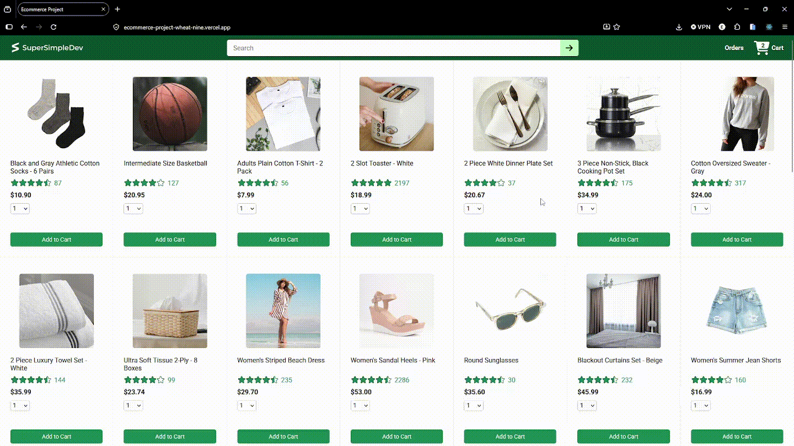
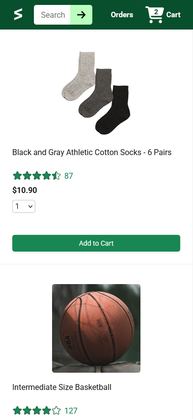

# 📷 Ecommerce Project

  

  <b>An ecommerce website built using React.js + TypeScript and Express</b>

---

## 📱 Responsive Demo

  

<b>Works on mobile phones!</b>

---

## 🚀 Live Demo

  <a href="https://ecommerce-project-wheat-nine.vercel.app/" target="_blank">
    Visit Live Site
  </a>

---

## 🛠️ Tech Stack

### Frontend

* **Vite 6.4.3** — Frontend build tool
* **React.js 19.3.0** — UI library
* **TypeScript 5.8.3** — Type-safe JavaScript
* **React Router 7.18.4** — Client-side routing
* **Axios 1.20.0** — HTTP requests in the full-stack application

### Backend

* **Node.js** — JavaScript runtime
* **Express 4.21.2** — Backend web framework
* **Sequelize 6.37.5** — Database ORM
* **MySQL2 3.14.1** — MySQL database driver
* **PostgreSQL (pg) 8.16.0** — PostgreSQL database driver

---

## 📂 Project Structure

Ecommerce-Project/
│
├── frontend-demo/
│   └── Demo frontend used for the hosted preview

└── Fullstack/
    └── Complete application source code

### Frontend Demo

The `frontend-demo` folder contains a **frontend-only version** of the project used specifically for the live Vercel demonstration.

It does not contain the complete backend/full-stack implementation.

### Fullstack

The `Fullstack` folder contains the **actual full-stack application code** intended for real deployment.

It includes the frontend and backend implementation and uses **Axios** for communicating with the backend/API.

---

## 📌 Note

The backend implementation was entirely AI-generated.